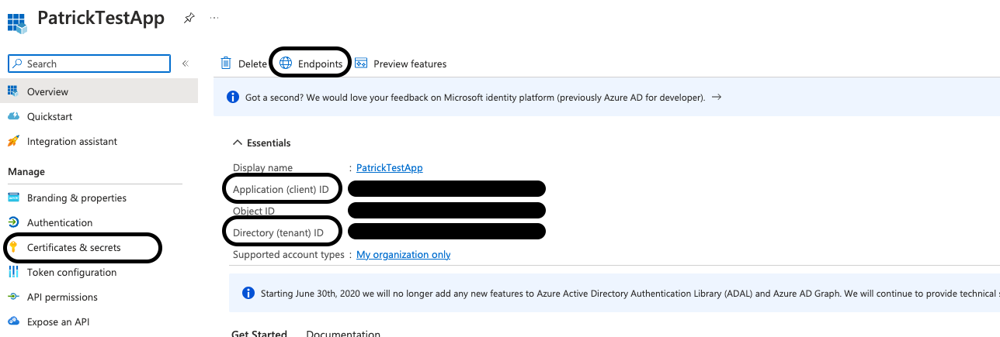
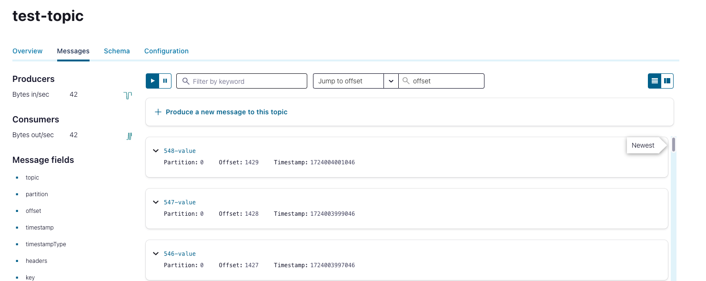

# OAuth for CFK with Azure Entra ID

[Confluent Platform 7.7](https://docs.confluent.io/platform/current/release-notes/index.html) and [CFK 2.9.0](https://docs.confluent.io/operator/current/release-notes.html) released OAuth support.
This repository sets up a basic CP cluster via CFK, any K8S cluster is ok even outside Azure.
external clients to use OAuth for authentication with Azure AD (Entra ID) as the identity provider.

In technical detail it deploys:
* 1 KraftController
* 3 Kafka brokers
* 1 Producer application (client)
* 1 Control Center

Prerequisites:
* Kubernetes cluster
* Access to Microsoft Entra ID. See

Resources:
 * [CP OAuth documentation](https://docs.confluent.io/platform/current/security/authentication/sasl/oauthbearer/overview.html#sasl-oauthbearer-authentication-overview)

## Deploy K8S Operator in a CFK cluster

* [Confluent for Kubernetes Quick Start](https://docs.confluent.io/operator/current/co-quickstart.html)

## Entra ID (Azure AD)

### Create Application

In [Azure AD](https://portal.azure.com/#view/Microsoft_AAD_IAM/ActiveDirectoryMenuBlade/~/Overview), on the left bar under App registrations, create a new one with the default configurations.
In the following, we will need:
```
tenant id -> see applications overview
token endpoint -> see OAuth 2.0 token endpoint (v1) under endpoints under applications overview
client id -> see client id under applications overview
secret id -> see secret value under Certificates & secrets on the left bar
```



### Create Secrets

In the application on the left bar under Certificates & secrets, create
new client secrets. Copy the client's secret value.

### Verify Token

Execute:

```shell
curl -X POST -H "Content-Type: application/x-www-form-urlencoded" \
-d 'client_id=[client_id]&scope=api://[client_id]/.default&client_secret=[client_secret value]&grant_type=client_credentials' \
https://login.microsoftonline.com/[tenant_id]/oauth2/token
```

Decode the responded `access_token` because we need the `iss` later on.

## Azure AD endpoints

For the later configuration we need to set the `token_endpoint`, the `jwks_uri`, and the `issuer`.
We can obtain all information via

```shell
curl https://login.microsoftonline.com/<tenant-id>/v2.0/.well-known/openid-configuration | jq
```

Generally, those are
```
token_endpoint = https://login.microsoftonline.com/<tenant-id>/oauth2/v2.0/token
jwks_uri = https://login.microsoftonline.com/<tenant-id>/discovery/v2.0/keys
issuer = https://login.microsoftonline.com/<tenant-id>/v2.0
```

## Azure AD applications

To retrieve the JWT token, CP is using the client credentials grant flow. So, we need to register an application in Azure AD
and create a secret. 
We can get a JWT token via: 
```
curl -X POST -H "Content-Type: application/x-www-form-urlencoded" \
-d 'client_id=[client_id]&client_secret=[client_secret value]&grant_type=client_credentials' \
https://login.microsoftonline.com/[tenant_id]/oauth2/token
```

> [!NOTE]
> In this example, we only register one application in Azure AD. Consider different applications with its secret per CP component
> and client.


## CFK cluster

* [CFK server-side OAuth/OIDC authentication](https://docs.confluent.io/operator/current/co-authenticate-kafka.html#server-side-oauth-oidc-authentication-for-ak-and-kraft)

Store the clientId and secret in a file and deploy it as a k8s secret. 
```shell
kubectl create -n confluent secret generic oauth-jass --from-file=oauth.txt=client-credentials.txt
```

Afterwards, we configure the Kafka CR
```yaml
listeners:
  external:
    authentication:
      type: oauth
      jaasConfig:
        secretRef: oauth-jass
      oauthSettings:
        groupsClaimName: groups
        subClaimName: sub
        audience: <client-id>
        expectedIssuer: see above
        jwksEndpointUri: see above
        tokenEndpointUri: see above
configOverrides:
  server:
    - listener.name.external.oauthbearer.sasl.server.callback.handler.class=org.apache.kafka.common.security.oauthbearer.secured.OAuthBearerValidatorCallbackHandler
    - listener.name.external.oauthbearer.sasl.jaas.config=org.apache.kafka.common.security.oauthbearer.OAuthBearerLoginModule required;
```

Once the `confluent-operator` is running, we deploy the cluster with 

```
kubectl apply -f ./cluster.yaml -n confluent
```

## Producer Container

Deploy the Producer (Pod having kafka cli tools)

```shell
kubectl apply -f ./producer.yaml -n confluent
```

Get into the producer Pod shell and configure client

```shell

cd /tmp

cat <<EOF >> client.properties
sasl.mechanism=OAUTHBEARER
security.protocol=SASL_PLAINTEXT
group.id=console-consumer-group
sasl.login.callback.handler.class=org.apache.kafka.common.security.oauthbearer.secured.OAuthBearerLoginCallbackHandler
sasl.oauthbearer.token.endpoint.url=https://login.microsoftonline.com/<tenant_id>/oauth2/v2.0/token
sasl.jaas.config=org.apache.kafka.common.security.oauthbearer.OAuthBearerLoginModule required \
      clientId="<client_id>" \
      clientSecret="client_secret>"\
      scope="<client_id>/.default";
EOF
```

Produce and read some records

```shell

/opt/kafka/bin/kafka-console-producer.sh \
  --bootstrap-server broker.confluent.svc.cluster.local:9092 \
  --topic test-topic \
  --producer.config client.properties

/opt/kafka/bin/kafka-console-consumer.sh \
  --bootstrap-server broker.confluent.svc.cluster.local:9092 \
  --topic test-topic \
  --consumer.config client.properties
```


## Control Center

* [CFK client-side OAuth/OIDC authentication](https://docs.confluent.io/operator/current/co-authenticate-kafka.html#client-side-oauth-oidc-authentication-for-ak-and-kraft)

# Port forward C3
kubectl port-forward controlcenter-0 9021:9021
```
We access C3 via `localhost:9021` and see the produced events:


